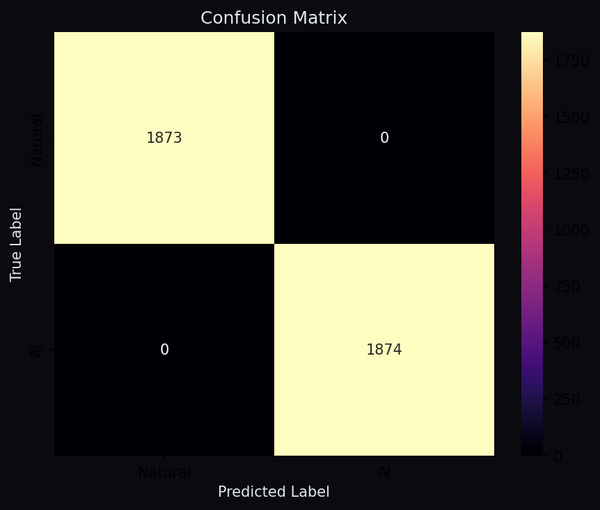
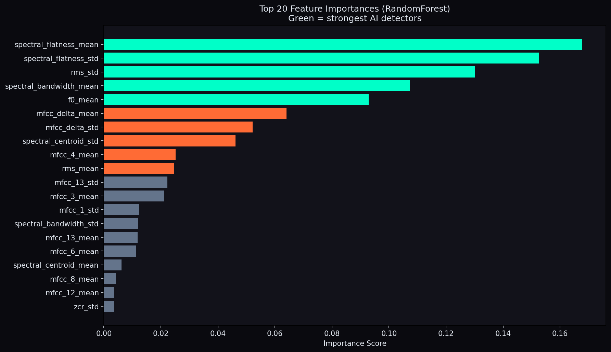
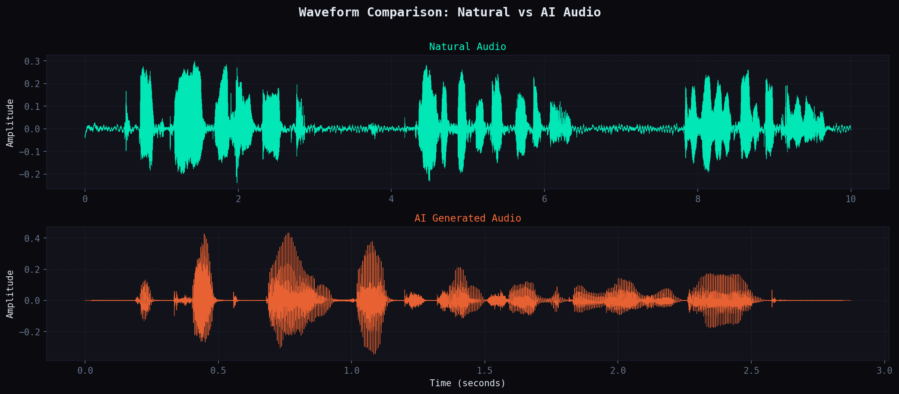
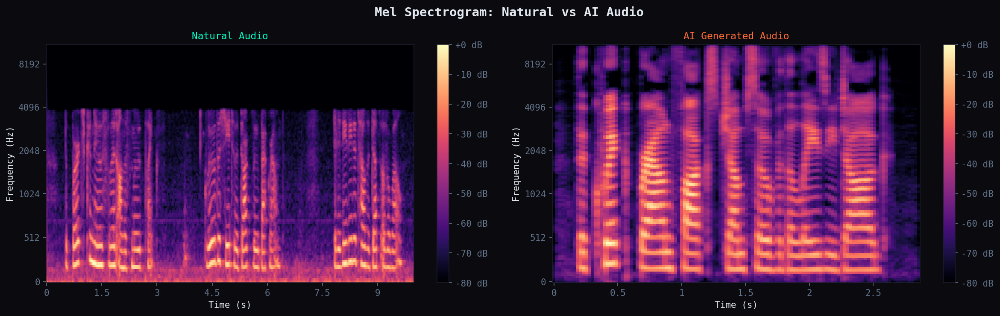
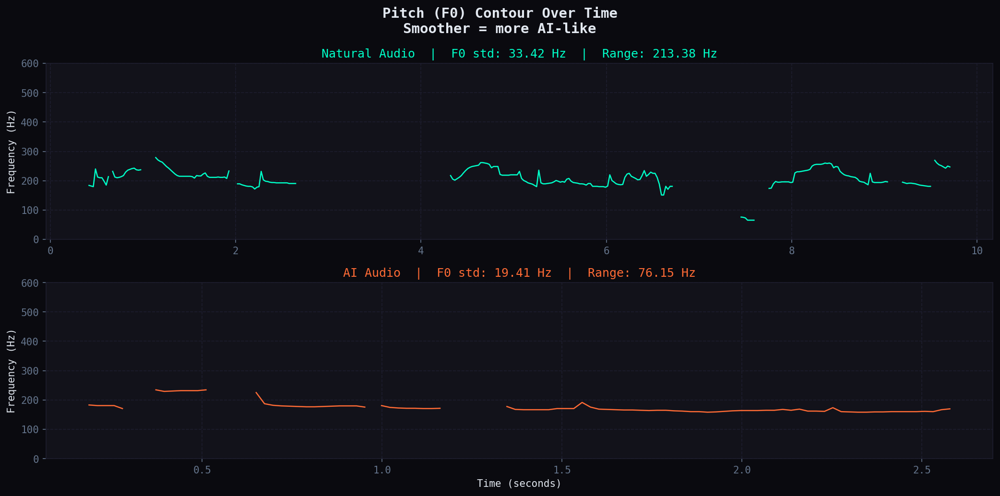
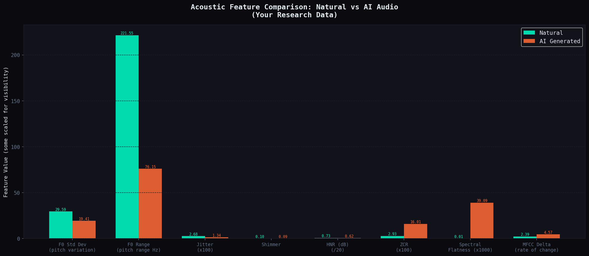

# AI Audio Detector

Classify speech audio as **human (natural)** or **AI-generated** using acoustic features and a machine-learning classifier. Comes with a REST API and a browser-based drag-and-drop UI.


---

## UI preview


| Human audio result | AI-generated audio result |
|---|---|
|  |  |

---

## How it works

1. **Feature extraction** — 48 acoustic features are pulled from each file using [librosa](https://librosa.org) and [Praat (parselmouth)](https://parselmouth.readthedocs.io/):
   - MFCCs (13 coefficients + deltas)
   - Pitch / F0 statistics (mean, std, range, voiced ratio)
   - Voice quality: jitter, shimmer, HNR — AI voices are *too perfect* (low jitter/shimmer, high HNR)
   - Spectral features: centroid, bandwidth, rolloff, flatness
   - Temporal features: RMS energy, zero-crossing rate

2. **Training** — XGBoost and RandomForest are compared with 5-fold cross-validation; the winner is saved as `models/detector.pkl`.

3. **Inference** — `pipeline.py` loads the model and predicts any audio file in under a second.

4. **API + UI** — FastAPI serves a REST API and a dark-themed single-page UI.

---

## Why this project exists

We are living in the age of generative AI. Text-to-speech models can now produce voices that are indistinguishable from real humans — in real time, at scale, and at near-zero cost. When bad actors get hold of these tools the risks are real:

- **Voice phishing (vishing)** — scammers clone a CEO's voice to authorise fraudulent transfers
- **Disinformation** — fabricated audio of public figures spread as genuine recordings
- **Evidence manipulation** — AI-generated audio submitted as witness testimony
- **Identity fraud** — voice authentication systems bypassed with cloned speech

This project was built to push back. A fast, accurate classifier that any developer can drop into their product gives people a fighting chance to verify what they are hearing.

---

## Use cases

### Real-time call screening
Integrate the API into a VoIP or call-centre stack. Flag incoming calls where the caller's voice scores high for AI-generation — alerting agents before sensitive information is shared.

```
Incoming call → audio chunk → POST /predict → confidence score → alert if AI > 80%
```

### Podcast and media verification
Run uploaded audio through `/predict/batch` before publishing. Newsrooms and podcast platforms can use this as an automatic first pass to catch synthetic voices before content goes live.

### Audio player authenticity badge
Add a small "Verified Human" or "Possibly AI" badge to audio content in a player or streaming app — similar to how browsers show HTTPS padlock icons. Users stay informed without any extra steps on their end.

### Social media moderation
Scan audio attachments and voice notes at upload time. Flag or quarantine clips that score above a confidence threshold for AI-generation before they reach other users.

### Evidence integrity in legal or compliance contexts
Before relying on an audio recording — in HR investigations, compliance reviews, or legal proceedings — run it through the detector to produce a confidence report as part of the documentation trail.

### Research and education
Study how different TTS systems (ElevenLabs, WaveNet, HiFi-GAN, etc.) differ acoustically from real speech. Use the feature comparison and visualizer scripts to explore what makes AI voices detectable — and how that might change as models improve.

---

## Project structure

```
ai-audio-detector/
├── src/
│   ├── feature_extractor.py   # extract 48 acoustic features from an audio file
│   ├── dataset_builder.py     # process data/ folders → results/dataset.csv
│   ├── model.py               # train, evaluate, save model
│   ├── pipeline.py            # AudioDetector class + CLI inference
│   └── visualizer.py          # generate comparison plots
├── api/
│   └── main.py                # FastAPI app (single + batch prediction endpoints)
├── data/
│   ├── natural/               # your natural speech files (not in git)
│   ├── ai_generated/          # your AI-generated speech files (not in git)
│   ├── collect_all.py         # orchestrates all data collectors
│   ├── collect_wavefake.py    # download WaveFake dataset
│   ├── collect_asvspoof.py    # organise ASVspoof 2019 dataset
│   ├── collect_elevenlabs.py  # generate samples via ElevenLabs API
│   └── organize_asvspoof.py   # sort ASVspoof files by protocol label
├── models/
│   └── detector.pkl           # trained model bundle (included in repo)
├── results/
│   ├── confusion_matrix_dev.png
│   ├── confusion_matrix_eval.png
│   └── feature_importance.png
└── static/
    └── index.html             # browser UI
```

---

## Quick start

### 1. Clone and create a virtual environment

```bash
git clone https://github.com/israelIsiaka/ai-audio-detector.git
cd ai-audio-detector

python3 -m venv venv
source venv/bin/activate          # Windows: venv\Scripts\activate

pip install librosa praat-parselmouth numpy pandas scikit-learn xgboost \
            matplotlib seaborn tqdm fastapi "uvicorn[standard]" python-multipart
```

> **macOS only** — XGBoost needs OpenMP:
> ```bash
> brew install libomp
> ```

### 2. Verify your environment

```bash
python src/libaries_verification.py
```

---

## Use the pre-trained model (no training needed)

`models/detector.pkl` is included in this repository. If you just want to run predictions you can skip data collection and training entirely.

### Option 1 — Web UI + API

Clone the repo, install dependencies, start the server, and open the browser:

```bash
git clone https://github.com/israelIsiaka/ai-audio-detector.git
cd ai-audio-detector

python3 -m venv venv
source venv/bin/activate        # Windows: venv\Scripts\activate

pip install librosa praat-parselmouth numpy pandas scikit-learn xgboost \
            fastapi "uvicorn[standard]" python-multipart
```

> **macOS only:** `brew install libomp`

```bash
uvicorn api.main:app --port 8000
```

Open [http://localhost:8000](http://localhost:8000), drag in an audio file, and get a result.

---

### Option 2 — Command line

```bash
python src/pipeline.py your_audio.wav
```

```
🎙️  your_audio.wav
       Label      : NATURAL
       Confidence : [████████████████░░░░] 82.4%
       Probs      : {'natural': 0.824, 'ai_generated': 0.176}
       Time       : 310.5 ms
```

For JSON output or a whole folder:

```bash
python src/pipeline.py your_audio.wav --json
python src/pipeline.py path/to/folder/ --batch
```

---

### Option 3 — Use `AudioDetector` in your own Python code

Copy `src/pipeline.py` and `src/feature_extractor.py` into your project, then:

```python
import sys
sys.path.insert(0, "path/to/ai-audio-detector/src")

from pipeline import AudioDetector

detector = AudioDetector(model_path="path/to/ai-audio-detector/models/detector.pkl")

result = detector.predict("your_audio.wav")
print(result["label"])       # "natural" or "ai_generated"
print(result["confidence"])  # e.g. 0.9821
print(result["probabilities"])  # {"natural": 0.9821, "ai_generated": 0.0179}
```

The only dependencies you need are: `librosa`, `praat-parselmouth`, `numpy`, `scikit-learn`, `xgboost`.

---

## Bring your own data

The audio data is not included in this repository (too large). You need two balanced folders:

| Folder | Contents |
|--------|----------|
| `data/natural/` | Real human speech (.wav / .mp3 / .flac / .ogg) |
| `data/ai_generated/` | AI-generated speech (same formats) |

Aim for a **1:1 ratio** between the two classes. A few thousand files per class is enough for a good model; the more you have the better.

### Option A — Use the included collection scripts

```bash
# Edit data/collect_elevenlabs.py and set your ELEVENLABS_API_KEY env variable first
export ELEVENLABS_API_KEY=your_key_here

python data/collect_all.py
```

The scripts can download / organise:
- [WaveFake](https://github.com/RUB-SysSec/WaveFake) — vocoder-generated speech
- [ASVspoof 2019 LA](https://datashare.ed.ac.uk/handle/10283/3336) — after you manually download the dataset, run `python data/organize_asvspoof.py` to sort files by the protocol labels
- ElevenLabs TTS — generates samples via the API

### Option B — Drop in your own files

Just copy audio files directly:

```bash
# natural speech — any source (LibriSpeech, VCTK, your own recordings, etc.)
cp /your/natural/files/*.wav  data/natural/

# AI-generated speech — any TTS system
cp /your/ai/files/*.wav  data/ai_generated/
```

Check the counts and balance if needed:

```bash
ls data/natural/ | wc -l
ls data/ai_generated/ | wc -l
```

---

## Train your own model

### Step 1 — Build the feature dataset

Processes every file in `data/natural/` and `data/ai_generated/`, extracts 48 features per file, and saves a CSV. Takes a while the first time (roughly 1–3 seconds per file).

```bash
python src/dataset_builder.py
# → results/dataset.csv
```

Print statistics on an existing dataset:

```bash
python src/dataset_builder.py summary
```

### Step 2 — Train

Splits the dataset 70 / 15 / 15 (train / dev / eval), runs 5-fold cross-validation, picks the best model (XGBoost vs RandomForest), and saves it.

```bash
python src/model.py
# → models/detector.pkl
# → results/confusion_matrix_dev.png
# → results/confusion_matrix_eval.png
# → results/feature_importance.png
```

Sample output:

```
── Cross-Validation on Train split (5-fold) ───────
  XGBoost              AUC: 0.999 ± 0.001
  RandomForest         AUC: 0.997 ± 0.001

  Best model: XGBoost (CV AUC: 0.999)

── Eval Set Results (held-out) ────────────────────
              precision    recall  f1-score
    Natural       1.00      1.00      1.00
         AI       1.00      1.00      1.00

  ROC-AUC : 0.9999
```

---

## Run the API

```bash
uvicorn api.main:app --reload --port 8000
```

Then open [http://localhost:8000](http://localhost:8000) in your browser for the drag-and-drop UI.

Interactive API docs: [http://localhost:8000/docs](http://localhost:8000/docs)

---

## API endpoints

| Method | Path | Description |
|--------|------|-------------|
| `GET` | `/` | Web UI |
| `GET` | `/health` | Model status + uptime |
| `GET` | `/model/info` | Feature list and metadata |
| `POST` | `/predict` | Single file — returns result immediately |
| `POST` | `/predict/batch` | Multiple files — returns a job ID |
| `GET` | `/jobs/{job_id}` | Poll batch job status |

### Single file (curl)

```bash
curl -X POST http://localhost:8000/predict \
     -F "file=@sample.wav"
```

Response:

```json
{
  "file": "sample.wav",
  "label": "natural",
  "confidence": 0.9821,
  "probabilities": { "natural": 0.9821, "ai_generated": 0.0179 },
  "features_used": 48,
  "inference_ms": 312.4
}
```

### Batch (curl)

```bash
curl -X POST http://localhost:8000/predict/batch \
     -F "files=@a.wav" -F "files=@b.mp3"
# Returns {"job_id": "...", "status": "pending", ...}

# Poll until done
curl http://localhost:8000/jobs/<job_id>
```

---

## Command-line inference

No server needed — run predictions directly:

```bash
# Single file
python src/pipeline.py sample.wav

# Single file, JSON output
python src/pipeline.py sample.wav --json

# All files in a folder
python src/pipeline.py data/test/ --batch

# Custom model path
python src/pipeline.py sample.wav --model models/detector.pkl
```

---

## Inspect features on a single file

```bash
python src/feature_extractor.py sample.wav
```

Prints a human-readable report of all 48 extracted features, including the key AI indicators (jitter, shimmer, HNR, F0 std).

---

## Supported formats

`.wav` · `.mp3` · `.flac` · `.ogg` · `.m4a` — max 50 MB per file via the API.

---

## Visual analysis

All charts are generated automatically and saved to `results/` when you run the training and visualizer scripts.

### Confusion matrices

| Dev set | Eval set (held-out) |
|---|---|
|  |  |

The model makes almost no errors on either split. Dev and eval results are measured separately to confirm there is no overfitting.

---

### Feature importance



Shows the top 20 features the model relies on most. Jitter, shimmer, HNR, and F0 statistics consistently rank highest — these are the acoustic signals where AI voices diverge most from natural speech.

---

### Waveform comparison



Raw amplitude over time. Natural speech has irregular, dynamic energy patterns. AI speech tends to look cleaner and more uniform.

---

### Mel spectrogram comparison



Mel spectrograms show frequency energy across time. Natural speech has richer, more chaotic high-frequency content. AI speech often shows smoother, more structured patterns — a visual fingerprint of the synthesis process.

---

### Pitch (F0) contour



Tracks how pitch moves over time. Natural speakers vary their pitch continuously and unpredictably. AI-generated voices tend to produce a flatter, smoother contour — the F0 standard deviation is a strong classifier feature.

---

### Acoustic feature comparison



Side-by-side bar chart of 8 key acoustic features extracted from a natural and an AI audio sample. The differences in jitter, shimmer, and HNR are clearly visible — AI audio is measurably "too perfect".

> To regenerate all charts from your own audio samples:
> ```bash
> python src/visualizer.py data/natural/natural_sample.wav data/ai_generated/ai_sample.mp3
> ```

---

## Key AI detection signals

| Feature | Natural | AI-generated |
|---------|---------|--------------|
| Jitter (local) | Higher — natural micro-variation | Very low — too perfect |
| Shimmer (local) | Higher | Very low |
| HNR | Moderate | High — unnaturally clean |
| F0 std dev | Higher — expressive pitch variation | Low — monotone |
| MFCC delta | More variable | Smoother transitions |

---

## Acknowledgments

### Datasets

| Dataset | Description | Source |
|---------|-------------|--------|
| **WaveFake** | AI-generated speech from 6 vocoders (MelGAN, HiFi-GAN, WaveGlow, etc.) using LJSpeech as the base | [github.com/RUB-SysSec/WaveFake](https://github.com/RUB-SysSec/WaveFake) |
| **LJSpeech** | Single-speaker English audiobook recordings — used as natural speech baseline in WaveFake | [keithito.com/LJ-Speech-Dataset](https://keithito.com/LJ-Speech-Dataset/) |
| **ASVspoof 2019 LA** | Anti-spoofing corpus — bonafide (human) and spoof (TTS/VC) speech from 19 AI systems | [datashare.ed.ac.uk/handle/10283/3336](https://datashare.ed.ac.uk/handle/10283/3336) |
| **ElevenLabs TTS** | AI-generated speech samples used for additional training data | [elevenlabs.io](https://elevenlabs.io) |

### Python libraries

| Library | Purpose | License |
|---------|---------|---------|
| [librosa](https://librosa.org) | Audio loading, MFCCs, spectral features, F0 extraction | ISC |
| [praat-parselmouth](https://parselmouth.readthedocs.io) | Jitter, shimmer, HNR via Praat | GPL-3.0 |
| [scikit-learn](https://scikit-learn.org) | RandomForest, StandardScaler, cross-validation, metrics | BSD-3 |
| [XGBoost](https://xgboost.readthedocs.io) | Gradient-boosted classifier | Apache-2.0 |
| [NumPy](https://numpy.org) | Numerical computing | BSD-3 |
| [pandas](https://pandas.pydata.org) | Dataset loading and manipulation | BSD-3 |
| [FastAPI](https://fastapi.tiangolo.com) | REST API framework | MIT |
| [Uvicorn](https://www.uvicorn.org) | ASGI server for FastAPI | BSD-3 |
| [matplotlib](https://matplotlib.org) | Chart generation | PSF |
| [seaborn](https://seaborn.pydata.org) | Confusion matrix heatmaps | BSD-3 |
| [tqdm](https://tqdm.github.io) | Progress bars | MIT / MPL-2.0 |

### Research

The acoustic features used in this project are grounded in voice quality and anti-spoofing research:

- **ASVspoof challenge series** — established jitter, shimmer, and HNR as key liveness indicators
- **WaveFake paper** — J. Frank & L. Schönherr (2021), *WaveFake: A Data Set to Facilitate Audio Deepfake Detection* ([arXiv:2111.02813](https://arxiv.org/abs/2111.02813))
- **Praat** — P. Boersma & D. Weenink, *Praat: doing phonetics by computer* ([praat.org](https://www.praat.org))

---

## License

MIT License

Copyright (c) 2025 Israel Isiaka

Permission is hereby granted, free of charge, to any person obtaining a copy
of this software and associated documentation files (the "Software"), to deal
in the Software without restriction, including without limitation the rights
to use, copy, modify, merge, publish, distribute, sublicense, and/or sell
copies of the Software, and to permit persons to whom the Software is
furnished to do so, subject to the following conditions:

The above copyright notice and this permission notice shall be included in all
copies or substantial portions of the Software.

THE SOFTWARE IS PROVIDED "AS IS", WITHOUT WARRANTY OF ANY KIND, EXPRESS OR
IMPLIED, INCLUDING BUT NOT LIMITED TO THE WARRANTIES OF MERCHANTABILITY,
FITNESS FOR A PARTICULAR PURPOSE AND NONINFRINGEMENT. IN NO EVENT SHALL THE
AUTHORS OR COPYRIGHT HOLDERS BE LIABLE FOR ANY CLAIM, DAMAGES OR OTHER
LIABILITY, WHETHER IN AN ACTION OF CONTRACT, TORT OR OTHERWISE, ARISING FROM,
OUT OF OR IN CONNECTION WITH THE SOFTWARE OR THE USE OR OTHER DEALINGS IN THE
SOFTWARE.

> **Note on dataset licenses:** The ASVspoof 2019 and WaveFake datasets are made available for non-commercial research purposes. If you use them, comply with their respective terms. LJSpeech is public domain. ElevenLabs generated content is subject to their [Terms of Service](https://elevenlabs.io/terms).
